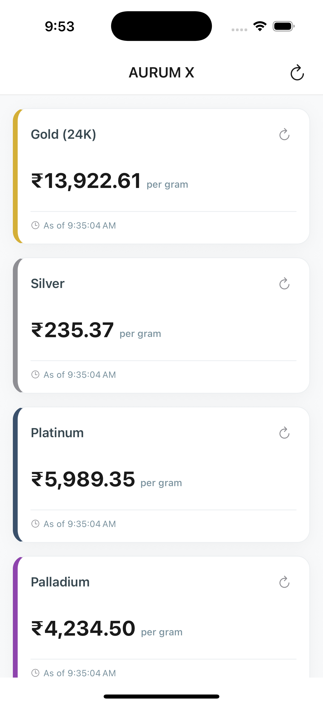

# AurumX - Gold & Precious Metals Rate Tracker

AurumX is a premium, high-performance **React Native** application designed to track live spot rates of precious metals (Gold, Silver, Platinum, and Palladium) in Indian Rupees (INR) per Gram. The application is built using modern standards including Redux Toolkit, React Navigation, MMKV for fast local caching, NetInfo for network state synchronization, and strict quota limitation overrides.

## 📸 App Preview

<p align="center">
  
</p>

---

## 📱 Key Features

* **Real Spot Rate Tracking**: Tracks live commodity prices (Gold, Silver, Platinum, Palladium) dynamically updated.
* **Intelligent Unit Conversion**: Automatically converts the raw Troy Ounces (`toz`) values returned by the API into Grams (`g`) using the standard `31.1034768` conversion factor.
* **Mathematical Accuracy**: Derives metrics (like Yesterday's Close as `Price - Daily Change`) dynamically before state updates to guarantee data consistency.
* **Multi-Layered Caching (MMKV)**: Leverages `react-native-mmkv` (C++ JSI) to perform synchronous database hydration at startup.
* **Offline UX Pattern**: Automatically detects network loss and shows fallback cached price rates with a `"No internet available to fetch fresh"` banner instead of throwing errors.
* **Quota Exhaustion Handler (Error 1203)**: Seamlessly intercepts account request exhaustion (error `1203`) and presents cached records alongside a **"Your free transactions limit has ended here. Showing cached data."** warning banner, or a dedicated error screen if no cache is present.
* **Production Obfuscation**: Pre-configured with the **Hermes engine** (bytecode pre-compilation) and **ProGuard** code minification for Android security.

---

## 🛠️ Tech Stack

* **Framework**: React Native (with TypeScript)
* **State Management**: Redux Toolkit (RTK)
* **Local Storage / Cache**: `react-native-mmkv`
* **Network Interceptor**: `axios` & `@react-native-community/netinfo`
* **Navigation**: `@react-navigation/native` (Stack Navigation)
* **Environment Configuration**: `react-native-config`

---

## 📂 Project Directory Structure

```text
aurumx/
├── docs/                             # Advanced Architecture Guides
│   ├── api-caching-guide.md          # Proxy caching architecture for production scale
│   ├── offline-caching-network-guide.md # Local caching strategy (MMKV) and NetInfo
│   └── redux-setup-guide.md          # Global state architecture & actions
├── src/
│   ├── constants/
│   │   └── api/                      # API Endpoints & Error Maps
│   ├── features/
│   │   ├── dashboard/                # Main Landing Screen and Tile Components
│   │   └── metalInfo/                # Spot details and Previous Close information
│   ├── hooks/                        # Custom React Hooks (Redux typed hooks, fetchers)
│   ├── navigation/                   # React Navigation Stack Setup
│   ├── services/
│   │   └── api/                      # Axios Instance and Interceptors
│   ├── store/
│   │   ├── index.ts                  # Centralized Redux Store Configuration
│   │   └── slice/                    # Redux Slices (metals.slice.ts)
│   └── types/                        # Shared TypeScript interfaces & types
```

---

## ⚙️ Environment Configuration

Create a `.env` file at the root of the project to setup the necessary environment parameters:

```env
BASE_URL=https://api.metals.dev/v1
API_KEY=LPB9GPKPJZIWDQQ25UPJ586Q25UPJ
```

---

## 🚀 Getting Started

### Step 1: Install Dependencies

```sh
npm install
```

For iOS devices, also run the CocoaPods dependency updates:

```sh
bundle install
bundle exec pod install
```

### Step 2: Start Metro Packager

Start the JavaScript bundler for Metro:

```sh
npm start
```

### Step 3: Run the Application

In a separate terminal window, build and start the application on your target simulator/emulator:

#### Android
```sh
npm run android
```

#### iOS
```sh
npm run ios
```

---